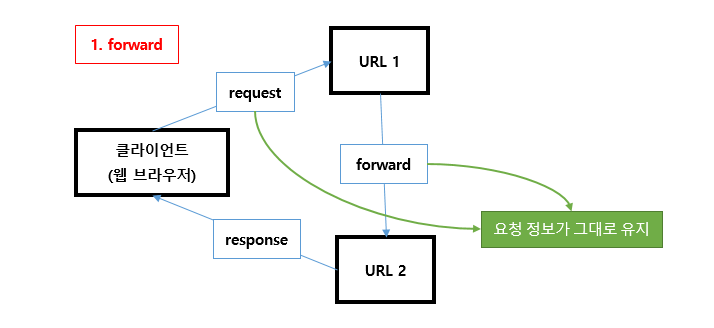
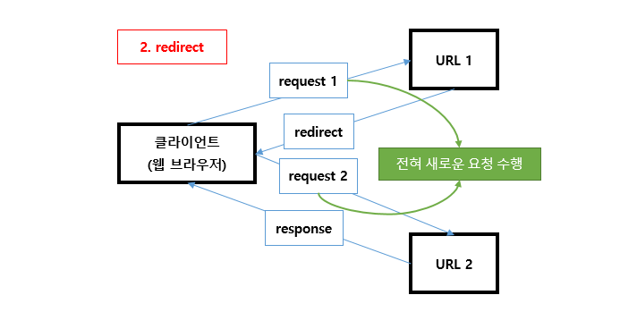

### JSP

------------------------

##### request

> 데이터를 요청함
>
> foward를 하면 request 객체가 그대로 지정한 파일에 전달됨
>
> : request와 response 동일한 객체가 전달


##### rediract

> request 와 response 가 다름
>
> request가 새로운 객체로 재 요청되고,
>
> 때문에 데이터를 넣어줘도 담아갈수 없음


##### response

> 응답되는 데이터를 받음
>
> \- 웹브라우저의 요청에 응답하는것을 말함
>
> \- 응답의 정보를 가지고 있는객체를 response객체라고 말함
>
> \- 서버측에서 클라이언트측으로 데이터를 전달하기 위한 객체


request와 response둘은 한쌍


##### cookie 와 session 의 등장 배경

>
>
>- 로그인을 통해 볼 수 있는 서비스. 장바구니 서비스. 등등 클라이언트가 정보를 유지하는 Stateful한 성격의 서비스가 점점 많아졌습니다.
>- 정보를 유지할 수 없는 Connectionless, Stateless의 성격을 가진 HTTP의 단점을 해결하기 위해 쿠키라는 개념이 도입되었습니다.
>
>
>
>**1. HTTP의 특징과 쿠키와 세션을 사용하는 이유**
>
>
>
>##### 쿠키와 세션은 위의 HTTP 특징을 해결하기 위해, 즉 클라이언트를 인증을 유지하기 위해 사용
>
>- 정보가 유지되지 않으면, 매번 페이지를 이동할 때마다 로그인을 다시 하거나,
>  상품을 선택했는데 구매 페이지에서 선택한 상품의 정보가 없거나 하는 등의 일이 발생할 수 있다.
>
>
>
>서버와 클라이언트가 통신을 할 때 마다 서버는 클라이언트가 누구인지 인증을 계속해야 합니다.
>
>그 이유는 HTTP 프로토콜이 connectionless, stateless한 특성이 있기 때문입니다.
>
>- **Connectionless 프로토콜 (비연결지향)**
>
>- - 클라이언트가 요청을 한 후 응답을 받으면 그 연결을 끊어 버리는 특징
>  - 클라이언트가 서버에 요청(Request)을 했을 때,
>    그 요청에 맞는 응답(Response)을 보낸 후 연결을 끊는 처리방식이다.
>    - HTTP 1.1 버전에서 연결을 유지하고, 재활용 하는 기능이 Default 로 추가되었다.
>      (keep-alive 값으로 변경 가능)
>
>- **Stateless 프로토콜 (상태정보 유지 안함)**
>
>- - 통신이 끝나면 상태를 유지하지 않는 특징
>  - 클라이언트의 상태 정보를 가지지 않는 서버 처리 방식이다.
>  - 클라이언트와 첫번째 통신에서 데이터를 주고 받았다 해도,
>    두번째 통신에서 이전 데이터를 유지하지 않는다.
>
>

##### session

> 
>
> **서버** 측에서 관리합니다.
>
> 접속 시간에 제한을 두어 일정 시간 응답이 없다면 세션을 끊도록 설정이 가능 합니다.
>
> 서버가 브라우저 기준으로 관리할때 하나의 브라우저의 해당함 (서버에 저장됨)
>
> 쿠키의 트래픽 문제와 쿠키를 변경하는 보안적 이슈를 해결하기 위해 등장
>
> - HTTP Session id를 식별자로 구별하여 데이터를 사용자의 브라우저에 쿠키형태가 아닌 접속한 서버 DB에 정보를 저장 합니다.
> - 클라이언트는 HTTP Session id를 쿠키로 메모리 저장된 형태로 가지고 있습니다.
> - 메모리에 저장하기 때문에 브라우저가 종료되면 사라지게 됩니다.
>
> ##### 장점
>
> - 서버에 저장하기 때문에 매우 관리하기 편하고 효율적입니다.
>
> ##### 단점
>
> - load-balancing/시스템 효율성에서 handling하기 어렵습니다.
>
> - 세션 저장 장치가 부족한 시스템에는 적합하지 않습니다.
>
>   

##### cookie

> 
>
> - 웹 서버가 브라우저에게 지시하여 사용자의 로컬 컴퓨터에
>
>   파일 또는 메모리에 저장하는 작은 기록 정보 파일.
>
> - 파일에 담긴 정보는 인터넷 사용자가 같은 웹사이트를 방문할 때마다 읽히고
>
>   수시로 새로운 정보로 바뀔 수 있습니다.
>
> - 쿠키에는 사용자 인증이 유효한 시간을 명시할 수 있으며, 한 번 유효 시간이 정해지면 브라우저를 끄더라도 인증이 유지된다는 특징이 있습니다.
>
>   
>
> ##### 쿠키(Cookie) 단점
>
> - 쿠키에 대한 정보를 매 헤더(Http Header)에 추가하여 보내기 때문에 `상당한 트랙픽`을 발생시킴.
>
> - 결제정보등을 쿠키에 저장하였을때 쿠키가 유출되면 `보안에 대한 문제점`도 발생할 수 있다.
>
>   
>
> 출처 및 참고 : 
>
> - https://nesoy.github.io/articles/2017-03/Session-Cookie
> - https://victorydntmd.tistory.com/34
>
> 


##### session과 cookie의 차이점을 설명하시오.

>- 
>
>쿠키와 세션은 비슷한 역할을 하며, 동작원리도 비슷합니다
>
>그 이유는 세션도 결국 쿠키를 사용하기 때문입니다.
>
>가장 큰 차이점은 **사용자의 기록 정보가 저장되는 위치**입니다.
>
>때문에 쿠키는 서버의 자원을 전혀 사용하지 않으며, 세션은 서버의 자원을 사용합니다.
>
>또한 **보안** 면에서 세션이 더 우수하며, **요청 속도**는 쿠키가 세션보다 더 빠른데, 그 이유는 세션의 경우 서버에서의 처리가 필요하기 때문입니다.
>
>
>
>1. **공통점** : 웹 통신간 **유지하려는 정보**(ex:로그인 정보 등)**를 저장**하기 위해 사용하는 것(?) 
>
>2. **차이점** : 저장위치, 저장형식, 용량제한, 만료시점 등 (해당 포스트 하단에 '표'로 정리됨)        
>
>   **쿠키** : **개인 PC**에 저장됨.        
>
>   **세션** : 접속중인 **웹 서버**에 저장됨.
>
>
>
>세션은 사용자의 수 만큼 서버 메모리를 차지하기 때문에 요즘은 이런 문제들을 보완한 **토큰 기반의 인증방식**을 사용하는 추세입니다.
>
>그 중 **JWT**( JSON Web Token )라는 것이 있는데 이에 대한 내용은 [여기](http://victorydntmd.tistory.com/115)를 참고
>
>
>
>
>
>
>
>출처 및 참고 :
>
>- https://hahahoho5915.tistory.com/32 
>
>


#####  required="required"

> 
>
>  input 태그 안에 `required` 를 추가해주면 해당 input을 입력하지 않고 제출을 누를 시 경고창이 뜨게 됩니다.
>
> ```html
> <input type="email" name="myemail" required="required">
> ```
>
> 
>
> - 여러 개 중 하나만 선택가능하도록 한, radio type 의 경우, 
>
>   name` 값이 모두 일치한다면 하나의 input 에만 required 를 추가해주면 됩니다.
>
> - 화면에 나타나는 경고창의 모양은 브라우져의 종류 및 버젼에 따라 달라집니다.
> - 필수 선택 여부를 동적으로 변환하고 싶을땐 Jquery를 사용하여 required 속성을 주거나 빼주면 됩니다
>
> ```javascript
> // 속성 추가
> $("[name=ti]").attr("required",true);
> 
> // 속성 제거
> $("[name=ti]").attr("required",false);
> ```
>
> 
>
> 참고 :
>
> https://m.blog.naver.com/PostView.nhn?blogId=neo_start&logNo=220302881127&proxyReferer=https:%2F%2Fwww.google.com%2F
>
> 


session.invalidate();

session.setAttribute("dto", dto);

session.setMaxInactiveInterval(10*60);


forward : 

> 요청에 대한 응답을 위임한다. 
>
> request 객체가 그대로 넘어간다
>
> 주소표시줄에는 요청한 A의 주소가 그대로 남고 실제로 표시되는건 B
>
> 데이터를 전달할게 있을때는 request객체가 살아있어야 하기때문에 forward를 사용한다
>
> 


Redirect : 

> 요청에대해 응답하다가 다시 요청시킴
>
> 따라서 새로운 request, 새로운 response 객체가 생김
>
> 요청한 A의 주소가 그대로 남고 실제로 표시되는건 B
>
> 데이터 없이 화면만 전환할때 사용
>
> 


##### 캐시

> 장점 : 재방문시 로딩속도가 빨라짐
>
> 단점 : 무언가를 수정하고 새로고침시에 캐시때문에 변경이 되지 않을 수 있음
>
> Cache란 자주 사용하는 데이터나 값을 미리 복사해 놓는 임시 장소를 가리킨다. 
>
> 저장공간 계층 구조에서 확인할 수 있듯이, 캐시는 저장 공간이 작고 비용이 비싼 대신 빠른 성능을 제공한다. 
>
> 
>
> **[ Local Cache ]**
>
> - Local 장비 내에서만 사용되는 캐시로, Local 장비의 Resource를 이용한다.
>
> - Local에서만 작동하기 때문에 속도가 빠르다.
>
> - Local에서만 작동하기 때문에 다른 서버와 데이터 공유가 어렵다.
>
>   
>
> ##### **[ Global Cache ]**
>
> - 여러 서버에서 Cache Server에 접근하여 사용하는 캐시로 분산된 서버에서 데이터를 저장하고 조회할 수 있다.
>
> - 네트워크를 통해 데이터를 가져오므로, Local Cache에 비해 상대적으로 느리다.
>
> - 별도의 Cache서버를 이용하기 때문에 서버 간의 데이터 공유가 쉽다.
>
>   


##### ! 톰켓서버 더블클릭시 서버의 port, http 버전 등을 보여줌


여러가지 오류가 있겠지만  <Context docBase>가 2개이상 명시되어있으면

톰캣은 어떤 프로젝트를 실행 해야 할지몰라 나는 오류가 날 수 있다.

<Context docBase="Jsp04_LoginBoard" path="/Jsp04_LoginBoard" reloadable="true" source="org.eclipse.jst.jee.server:Jsp04_LoginBoard"/></Host>

</Host>부분을 제외하고 서버를 clean한 뒤에 다시 실행하면 에러 해결됨


src 폴더 : 소스 코드가 들어갈 곳


### Servlet

------

#### Java 영역 안에서 html을 만든다 (Jsp와 반대)


- javax.servlet.http.HttpServlet 자동으로 http를 상속받게 되어있음

- URL mapping : 해당 요청이 들어오면 현재 만들고있는 클래스와 연결해 주겠다

- Rest(ful) : resource() 기반으로 사용하겠다


인코딩 설정 중요,...

request.setCharacterEncoding("UTF-8");
response.setContentType("text/html; charset=UTF-8");


프로젝트 우클릭 -> Java EE -> Generate.... 

 = web.xml파일 만들어짐


web.xml파일 : 중요... 


여러개의 서블릿을 만들 수 있음 (기능별로 나누어 요청을 각각 따로할수 있게 만들어두면 합치거나 에러났을때 편함 기능별로 나누어 주어야함)


요청을 어떻게 하느냐에 따라 응답 받는 방식이 달라짐

>
>
>


•	scope : 객체 전달 범위


1)page : 현재 페이지에서 객체를 전달 (현재 페이지의 객체 유지)

2) request : 현재 페이지에서 요청한 다음 페이지까지만 객체 전달

​			        (요청된 페이지까지 객체 유지)

3) session : 현재 Browser 에서 context 내에 있는 모든 페이지에 객체 유지 (session 만료 전까지)

4) application : 현재 context 내에서 객체 유지. WebXML 에서도 사용 가능 (만들어둔 application, project 안에서 계속)


•	* 공통 메소드 : setAttribute, getAttribute, removeAttribute, getAttributeName


자바안의 html이 어려워서 html안에 java를 넣은 jsp를 만들었고

html이 나왔다