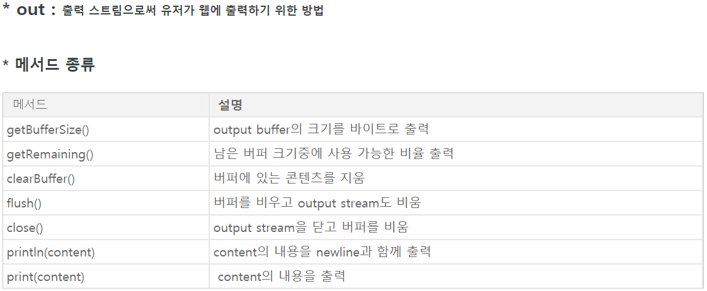
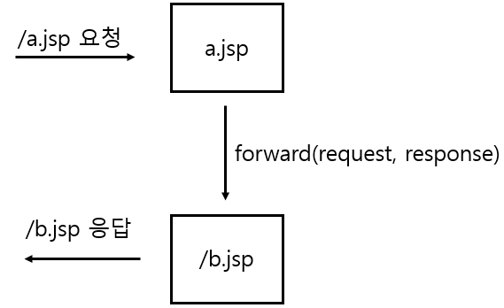
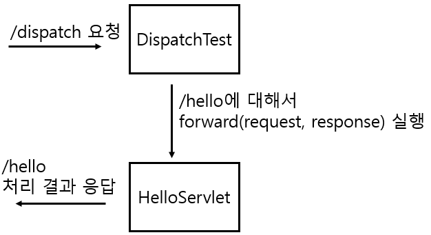
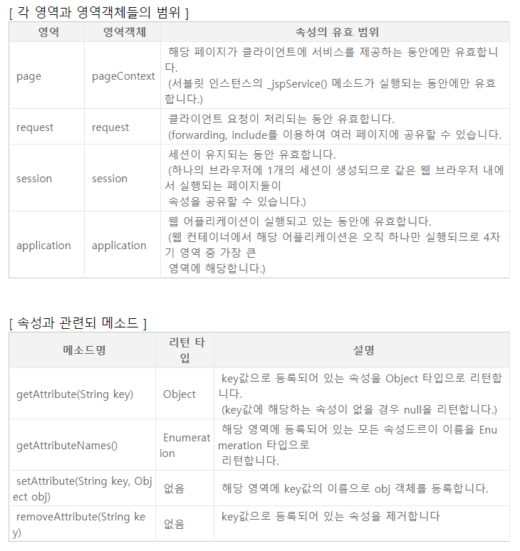

### Servlet

------


##### 글작성시 Forward와 Redirect 의 응답 차이

>
>
>```java
>if(command.equals("write")) {
>	// 글작성 페이지로
>	response.sendRedirect("boardwrite.jsp");
>		
>} else if (command.equals("writeres")) {
>			
>// 값을 받아옴
>	String writer = request.getParameter("writer");
>	String title  = request.getParameter("title");
>	String content = request.getParameter("content");
>			
>	MVCBoardDto dto = new MVCBoardDto(writer, title, content);
>			
>	int res = dao.insert(dto);
>			
>	if(res > 0) {
>// 작성 완료, 성공시 list로 보냄		
>				
>// 컨트롤러가 응답하여 처리를 모두했고,
>// 그 뒤에 list로 재 요청 시켜서 다시 객체가 만들어짐
>// 새로고침 해서 다시 요청해봤자 객체가 없는 list만 응답됨
>// 컨트롤러가 아닌 클라이언트가 원하는 페이지를 처리만 한뒤에 다시 응답시킴
>	response.sendRedirect("controller.do?command=list");
>				
>// 새로고침 : 클라이언트에서 다시 요청하겠다
>
>// 아래와 같은 경우 forward를 사용했기 때문에
>// 서버안의 컨트롤러가 list에 권한,객체를 다담아서 보내두었고.
>// list가 요청받아 응답시켜줌
>// 새로고침을 하면 다시 컨트롤러를 요청하게되고
>//request객체와 권한이 그대로 살아있기 때문에 새로고침 할때마다 글작성이 됨
>
>/*
>// list.jsp 에 값이 들어가서 보여져야 하기때문에 다시 list값을 가져와주어야함
>request.setAttribute("list", dao.selectList());
>RequestDispatcher dispatch = request.getRequestDispatcher("boardlist.jsp");
>dispatch.forward(request, response);
>*/
>
>	} else {
>// 실패시 위의 객체가 저장되지 않도록 Redirect해서 글작성 페이지로 넘김
>		response.sendRedirect("boardwrite.jsp");
>	}
>```
>
>


##### 한가지 command에서 두가지 기능 (좋지않음)

>
>
>```java
>if(command.equals("updateres")) {
>			
>	int seq = Integer.parseInt(request.getParameter("seq"));
>	String title  = request.getParameter("title");
>	String content = request.getParameter("content");
>			
>	MVCBoardDto dto = new MVCBoardDto(seq, title, content);
>			
>	int res = dao.update(dto);
>			
>	// alert창 띄우기
>	// print! 암기
>	PrintWriter out = response.getWriter();				
>			
>			
>	if(res > 0) {
>	
>		response.sendRedirect("controller.do?command=list");
>				
>// 아래처럼 updateres에서 작성페이지로 보내기, 작성완료된것 처리하기를 한번에 하면
>// 객체지향 프로그램 : 객체를 기능별로 나눈다 에 맞지않고 유지보수가 힘들어지며
>// 한가지 기능이 무거워질때 다른기능의 응답이 느려질 수 있기때문에 좋지않다
>				
>		/*
>		request.setAttribute("list", dao.selectList());
>		RequestDispatcher dispatch = 
>		request.getRequestDispatcher("boardlist.jsp");
>		dispatch.forward(request, response);
>				*/
>				
>	} else {				
>	
>		response.sendRedirect("boardupdate.jsp");
>				
>		/*
>		request.setAttribute("list", dao.selectOne(seq));
>		RequestDispatcher dispatch = 
>		request.getRequestDispatcher("boardupdate.jsp");
>		dispatch.forward(request, response);
>		*/
>	}
>```
>
>


##### PrintWriter

>
>
>https://dololak.tistory.com/326
>
>
>
>##### out
>
>>
>>
>>
>>
>>
>
>
>
>printwriter와 response. 의 사용
>
>```java
>PrintWriter out = response.getWriter();				
>			
>				
>// println으로 응답이 끝나기때문에 response를 또 하지 않고
>// 밑에 out.flush()에서 끝나버림 그렇기 때문에
>// 스크립트 구문안에 location으로 가라고 말해주어야함
>// 즉 하단의 명령문과 out명령어 둘중 하나만.
>out.println("<script type='text/javascript'> alert('성공'); location.href='controller.do?command=list' </script>");
>out.flush();
>				
>//response.sendRedirect("controller.do?command=list");
>```
>
>


##### post 메서드에서 get 메서드로 처리하겠다

```java
protected void doPost(HttpServletRequest request, HttpServletResponse response) throws ServletException, IOException {
		
	// post로 요청이 들어와도 doGet 메서드에서 처리하겠다
	doGet(request, response);
		
}
```


##### request 객체의 이동

>
>
>request와 response는 페이지 하나마다 달려있음
>
>request는 요청한 곳까지만 객체가 살아있는데, index에서 result로 요청해도
>
>실제로 요청하고, 요청이 들어가는곳은 서버이기 때문에
>
>아래와 같이 처리하면 서버에서 request객체가 사라져 버림
>
>포워드는 페이지 하나에 붙어있는 request와 response를 잘라 그대로 전달, 보내줌
>
>
>
>##### index.jsp
>
>```jsp
><%
>	pageContext.setAttribute("pageId", "my pageId value!!");
>	request.setAttribute("requestId", "my request value!!");
>	session.setAttribute("sessionId", "my sessionId value!!");
>	application.setAttribute("applicationId", "my appilcationId value!!");
>%>
>
>	<h1>index</h1>
>	
>	pageId : <%=pageContext.getAttribute("pageId") %> <br>	
>	requestId : <%=request.getAttribute("requestId") %> <br>
>	session : <%=session.getAttribute("sessionId") %> <br>
>	application : <%=application.getAttribute("applicationId") %><br>
>	
>	<!-- <a href="result.jsp">result...</a> -->
>	
>	<!-- 
>		request영역은 요청한곳 까지만 살아있고,
>		요청은 서버로 가기때문에
>		서버까지 가서 사라짐 즉 다음 페이지에서 살아있지 않음
>		a태그랑 관계없이 request라고 하면 서버로 요청
>	-->	
>	<!-- param은 데이터를 넘겨주었기 때문에 나옴 -->
>	<a href="result.jsp?param=myrequestparamvalue">result...</a>
>	<br>
>	<a href="controller.do">controller...</a>
>	
>	<!-- 
>		forward 하면 request객체를 위임하기 때문에 서버에서 위임할 곳까지 넘겨줌
>	-->
>	<%pageContext.forward("controller.do"); %>
>
>```
>
>
>
>**result.jsp**
>
>```jsp
><h1>result</h1>
>	
>	<!-- page : 현재 페이지에서 객체를 전달 (현재 페이지의 객체 유지) 따라서 나오지 않음 -->
>	pageId : <%=pageContext.getAttribute("pageId") %><br>
>	
>	<!-- 
>		값이 나오지 않음
>		forward를 하면 result의 request가 index의 request객체가 됨
>		그래서 이용 가능하게 됨 
>	-->
>	requestId : <%=request.getAttribute("requestId") %><br>
>	
>	sessionId : <%=session.getAttribute("sessionId") %><br>
>	applicaionId : <%=application.getAttribute("applicationId") %><br>
>	
>	<!-- 값이 나옴 -->
>	requestParam : <%=request.getParameter("param") %>
>
>```
>
>


##### RequestDispatcher

>
>
>- RequestDispatcher는 클라이언트로부터 최초에 들어온 요청을 JSP/Servlet 내에서
>
>  원하는 자원으로 요청을 넘기는(보내는) 역할을 수행하거나,
>
>- 특정 자원에 처리를 요청하고 처리 결과를 얻어오는 기능을 수행하는 클래스입니다. 
>
>- 즉 /a.jsp 로 들어온 요청을 /a.jsp 내에서 RequestDispatcher를 사용하여 
>
>  b.jsp로 요청을 보낼 수 있습니다.
>
>- 또는 a.jsp에서 b.jsp로 처리를 요청하고 b.jsp에서 처리한 결과 내용을 a.jsp의
>
>  결과에 포함시킬 수 있습니다.
>
>
>
>- 요청을 보내는 방법으로는 RequestDispatcher#forward()와 RequestDispatcher#include() 두 가지 방법이 있습니다.
>
>

##### RequestDispatcher의 forward() 메서드

>
>
>- forward() 메서드는 대상 자원으로 제어를 넘기는 역할을 합니다. 
>
>- 브라우저에서 /a.jsp로 요청했을 때 /a.jsp에서 forward()를 실행하여 /b.jsp로 제어를 넘길 수 있습니다. 
>
>- 제어를 넘겨받은 /b.jsp는 처리 결과를 최종적으로 브라우저에게 출력합니다.
>
>- 브라우저 입장에서는 /a.jsp를 요청했지만 받은 결과는 /b.jsp의 결과입니다.
>
>- 이때 HTTP 리다이렉트 방식과는 달리 하나의 HTTP 요청(Request) 범위 안에서 동작이 이루어집니다.
>
>  
>
>
>
>
>
>예1)
>
>BoardController.java { Jsp03_MVC01_Servler }
>
>```java
>if (command.equals("update")) {
>		
>	int seq = Integer.parseInt(request.getParameter("seq"));
>			
>	request.setAttribute("list", dao.selectOne(seq));
>	RequestDispatcher dispatch = request.getRequestDispatcher("boardupdate.jsp");
>	dispatch.forward(request, response);
>	
>}
>```
>
>
>
>예2)
>
>forward()는 특정 자원으로 제어를 넘긴다고 했는데 대상 자원은 Servlet 또는 JSP 페이지가 됩니다(JSP도 결국은 최종적으로 서블릿이므로).
>
>여기서는 서블릿으로 실습을 진행하지만 JSP페이지에서도 application이나 request 내장객체를 통해서 RequestDispatcher 를 얻어 forward()를 실행할 수 있습니다.
>
>다음과 같이 DispatchTest(/dispatch) -> HelloServlet(/hello) 로 forward()를 실행하는식으로 진행합니다.
>
>
>
>
>
>
>
>
>
>- forward()는 제어가 넘어간 이후 다지 이전의 자원으로 제어가 돌아가지 않으므로 호출하는쪽의 처리를 모두 완료한 후 제어를 넘겨야 합니다.
>
>- forward() 실행시에는 HttpServletRequest와 HttpServletResponse 객체를 같이 넘겨주기 때문에 호출한 쪽과 호출당한 쪽에서 이 두 가지의 객체를 공유합니다.
>
>```java
>public class DispatchTest extends HttpServlet { 
>     @Override 
>     protected void service(HttpServletRequest request, HttpServletResponse response) throws ServletException, IOException { 
>          
>         request.setCharacterEncoding("UTF-8"); 
>         request.setAttribute("name", "doloak"); //사전처리 
>           
>         RequestDispatcher dispatcher = request.getRequestDispatcher("/hello"); 
>         dispatcher.forward(request, response); 
>         
>    }
>}
>```
>
>

**! forward() 사용시 주의할 점**

> 
>
> forward()는 제어를 넘기기 이전에 출력 버퍼를 비우기 때문에
>
> a.jsp -> b.jsp로 호출시 a.jsp에서 어떤 내용을 버퍼에 출력했더라도 무시되며
>
> 제어가 넘어간 b.jsp의 출력 내용만 브라우저에게 전달되므로 주의하도록 합니다.
>
> 
>
> 출처 및 참조 : https://dololak.tistory.com/502


**영역(Scope)과 속성(Attribute)**

> 
>
> : JSP 제공하는 내장 객체들 중 session, request, application 들은
>
> 해당 객체에 정의된 유효 범위 안에서 서로 다른페이지라 할지라도
>
> 필요한 객체(데이터)들을 저장하고 읽어 들임으로써 서로 공유할 수 있는 특정 공간을 가지고있습니다. 
>
> 이때 **공유되는 데이터를** **속성(Attribute)**이라 하며
>
> **속성을 공유할 수 있는 유효 범위를 영역(Scope)**이라고 합니다.
>
> 
>
> 
>
> 
>
> 출저 및 참고 :
>
> https://m.blog.naver.com/PostView.nhn?blogId=vgod&logNo=220631686071&proxyReferer=https:%2F%2Fwww.google.co.kr%2F
>
> 

##### 페이지 이동

> 
>
> 1) forward action에 의한 페이지 이동
> \- 페이지이동시 이동시킨 페이지와 이동한 페이지는 request를 공유
>
> 2) response.sendRedirect()에 의한 페이지이동
> \- 메서드에 지정된 url 페이지로 이동 시키는데 새로운 요청을 발생시키면서 이동한다. 이동한 후에도 로직은 계속 실행이 되므로 return을 이용해서 수행 중지하게 한다.
>
> 3) location.href()에 의한 페이지 이동
> \- response.sendRedirect()와 결과는 동일
>  But, 자바 스크립트 명령이기 때문에 클라이언트에서 실행을 한다.
>  response.sendRedirect()는 서버에서 실행된다.
>
> 
>
> #### [scope 영역, 내장객체 설명](JSP_scope&Implict_Object.md) 참고
>
> 


##### \<jsp:forward> 액션태그

>
>
>**forward 액션태그 사용시 <jsp:param> 태그로 데이터 전달하기**
>
>이전글에서 보았던 forward 액션태그를 사용하여 다른 JSP 페이지로 제어 흐름을 넘길 수 있습니다. 이때 제어를 넘겨받는 JSP쪽으로 데이터를 넘겨주어 공유하고 싶은 경우가 생길 수 있는데 <jsp:param> 액션태그를 이용하면 됩니다.
>
>사용 방법은 <jsp:forward> 태그 하위에 <jsp:param> 태그를 넣는것이며 name과 value 속성을 이용합니다. name 속성이 key가 되며, value 속성이 넘길 값이 됩니다. 넘기는 값은 String 타입을 갖습니다.
>
>
>
>**main.jsp**
>
>main.jsp에서는 forward 액션태그를 통해 forwarding.jsp 페이지를 호출하며 이때 파라미터로 value1, value2 를 같이 넘깁니다. value1은 변수로 따로 선언해두고 표현식을 사용하였습니다.
>
>```jsp
><%@ page contentType="text/html; charset=utf-8"%>                                
><%
>     String value = "forwarding value";
>%>
> 
> 
><jsp:forward page="forwarding.jsp">
>     <jsp:param name="value1" value="<%= value %>"/>
>     <jsp:param name="value2" value="22222"/>
></jsp:forward>
>```
>
>
>
>**forwarding.jsp**
>
>forwarding.jsp에서는 넘긴 파라미터를 request 객체를 통해 가져옵니다.
>
>```jsp
><%@ page contentType="text/html; charset=utf-8"%>                                
><html>
><head>
></head>
><body>
><%
>     String value1 = request.getParameter("value1");
>     String value2 = request.getParameter("value2");
>%>
>     <h1>value1 : <%= value1 %></h1>
>     <h1>value2 : <%= value2 %></h1>
></body>
></html>
>```
>
>
>
>##### 추가 및 참고 :
>
>[\<jsp:param> 액션태그와 사용자 요청 파라미터가 겹치는 경우](https://dololak.tistory.com/498)
>
>[비슷하게 태그에서 동작하는 요청받기 요청하기 include, forward 태그](https://m.blog.naver.com/PostView.nhn?blogId=kikw331133&logNo=220806963702&proxyReferer=https:%2F%2Fwww.google.com%2F)
>
>
>
>출처: https://dololak.tistory.com/524
>
>