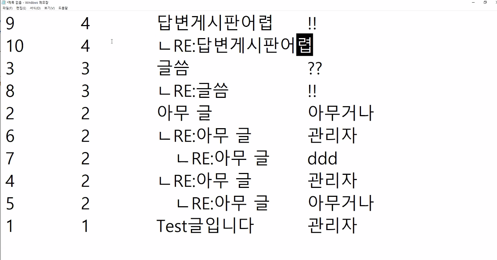
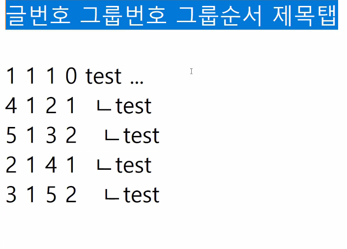
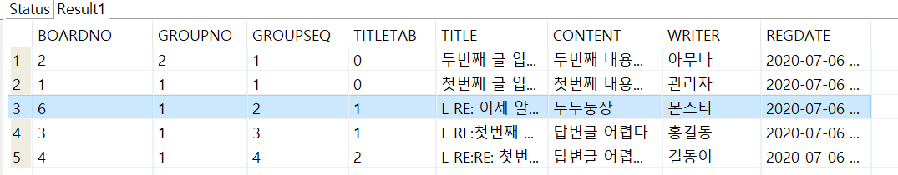

## 게시판 답변글

- 글 번호와 해당 글이 속하는 그룹 번호가 있음
- 글 번호는 새로운 글이 만들어 질때마다 +1
- 글 과 해당 글에대한 답변글들은 같이 움직여야함 (그룹번호)
- 그룹번호는 해당 글과 해당글의 답변글의 번호가 같아야함
- 답변글이 달리는 순서도 정해주어야함
- 각각 댓글과 대댓글이라는걸 표기하는 공백수준이 설정되어야함
- 답변글은 부모글의 다음 순서(+1), 부모글의 다음 공백(+1), 그룹번호는 같아야함
- 부모글보다 순서가 더 큰 아이들(기존 답변글)을 먼저 하나씩 순서를 밀어두고 새 글을 달아 앞으로 순서가 오게함







### SQL

------


```SQL
CREATE SEQUENCE BOARDNOSEQ;
CREATE SEQUENCE GROUPNOSEQ;

--게시판 답변기능 : 글번호 그룹번호 그룹순서 제목탭
--기존의 게시판 기능 : 제목 내용 작성자 작성일
CREATE TABLE ANSWERBOARD(

	BOARDNO NUMBER PRIMARY KEY,
	GROUPNO NUMBER NOT NULL,
	GROUPSEQ NUMBER NOT NULL,
	TITLETAB NUMBER NOT NULL,
	TITLE VARCHAR2(1000) NOT NULL,
	CONTENT VARCHAR2(4000) NOT NULL,
	WRITER VARCHAR2(500) NOT NULL,
	REGDATE DATE NOT NULL

);

SELECT BOARDNO, GROUPNO, GROUPSEQ, TITLETAB, TITLE, CONTENT, WRITER, REGDATE
FROM ANSWERBOARD
ORDER BY GROUPNO DESC, GROUPSEQ;
-- 가장 마지막에 만들어진 GROUPNO가 가장 최신글 (DESC)
-- GROUPSEQ = ASC 

-- 1번 글 작성
INSERT INTO ANSWERBOARD
VALUES (BOARDNOSEQ.NEXTVAL, GROUPNOSEQ.NEXTVAL, 1, 0, '첫번째 글 입니다', '첫번째 내용입니다', '관리자', SYSDATE);

-- 2번 글 작성
INSERT INTO ANSWERBOARD
VALUES (BOARDNOSEQ.NEXTVAL, GROUPNOSEQ.NEXTVAL, 1, 0, '두번째 글 입니다', '두번째 내용입니다', '아무나', SYSDATE);

-------------------------------업데이트와 추가는 세트--------------------------------

-- 답변글 (3번글에)에 답변 추가
-- 1. UPDATE (부모와 같은그룹, 부모순서 +1)인 글들의 순서를 +1
UPDATE ANSWERBOARD
SET GROUPSEQ = GROUPSEQ + 1 -- 순서 +1
WHERE GROUPNO = (SELECT GROUPNO FROM ANSWERBOARD WHERE BOARDNO = 3) -- 그룹번호가 부모의 그룹번호와 같고,
AND GROUPSEQ > (SELECT GROUPSEQ FROM ANSWERBOARD WHERE BOARDNO = 3); -- 부모의 그룹 순서보다 더 큰 번호를 가진 글들
		
-- 2. INSERT : 부모와 같은 그룹, 부모 순서 +1, 부모의 제목공백 +1
INSERT INTO ANSWERBOARD
VALUES (BOARDNOSEQ.NEXTVAL, -- 글번호 카운트
		(SELECT GROUPNO FROM ANSWERBOARD WHERE BOARDNO = 3), --그룹넘버를 부모의 넘버와 같게
		(SELECT GROUPSEQ FROM ANSWERBOARD WHERE BOARDNO = 3) + 1, -- 그룹내부순서를 부모보다 +1
		(SELECT TITLETAB +1 FROM ANSWERBOARD WHERE BOARDNO = 3), -- 공백을 부모 공백 + 1
		--(SELECT TITLETAB FROM ANSWERBOARD WHERE BOARDNO = 3) + 1 -- 위와 같음 카운트 하면서 가져오나 가져오고나서 카운트하나 같음
		'L RE:RE: 첫번째의 첫번째 글 입니다',
		'답변글 어렵다2',
		'길동이',
		SYSDATE
		);
		
-------------------------------------------------------------------

UPDATE ANSWERBOARD
SET GROUPSEQ = GROUPSEQ + 1 -- 그룹 내부순서 +1
WHERE GROUPNO = (SELECT GROUPNO FROM ANSWERBOARD WHERE BOARDNO = 1) 
-- 그룹번호가 부모와 같고
AND GROUPSEQ > (SELECT GROUPSEQ FROM ANSWERBOARD WHERE BOARDNO = 1); 
-- 그룹내부순서가 부모보다 큰

INSERT INTO ANSWERBOARD
VALUES(BOARDNOSEQ.NEXTVAL,
	(SELECT GROUPNO FROM ANSWERBOARD WHERE BOARDNO = 1), -- 그룹번호는 부모와 같다
	(SELECT GROUPSEQ + 1 FROM ANSWERBOARD WHERE BOARDNO = 1), -- 그룹내부순서는 부모보다 +1
	(SELECT TITLETAB +1 FROM ANSWERBOARD WHERE BOARDNO = 1), -- 공백은 부모보다 +1
		'L RE: 이제 알겠다',
		'두두둥장',
		'몬스터',
		SYSDATE
		);
```




biz에서 insert와 update 모두가 완료되어야 commit되도록 트랜젝션 처리도 해주어야함

>
>
>