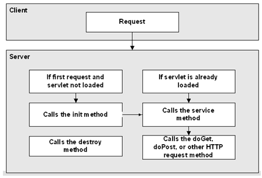

### **1. Servlet 생명 주기** **( Life Cycle )**

------

클라이언트가 Servlet에 요청을 하면, Servlet은 바로 호출이 되지 않습니다.

Servlet은 객체를 생성하고 초기화 작업을 거친 후, 요청을 처리하는 생명 주기를 갖고 있습니다.




Servlet의 생명 주기는 다음과 같이 이루어집니다.

JSP 페이지도 결국은 Servlet이기 때문에 아래와 같은 생명 주기를 갖습니다.

1. 요청이 오면, Servlet 클래스가 로딩되어 요청에 대한 **Servlet 객체가 생성**됩니다.
2. 서버는 init() **메소드를** 호출해서 **Servlet을  초기화** 합니다.
3. service() 메소드를 호출해서 Servlet이 **브라우저의 요청을 처리**하도록 합니다.
4. service() 메소드는 특정 **HTTP 요청(GET, POST 등)을 처리**하는 메서드 (doGet(), doPost() 등)를 호출합니다.
5. 서버는 destroy() 메소드를 호출하여 **Servlet을 제거**합니다.


톰캣은 Servlet을 다음과 같이 관리하고 있습니다.

- Servlet 객체를 생성하고 초기화하는 작업은 비용이 많은 작업이므로, 다음에 또 요청이 올 때를 대비하여 이미 생성된 **Servlet 객체는 메모리에 남겨둡니다.**
- 또 톰캣이 종료되기 전이나 reload 전에 모든 Servlet을 제거하게 됩니다.
- 이렇게 톰캣은 자원을 아끼면서 Servlet을 사용하고 있습니다.

개발자인 우리들도 자원을 효과적으로 사용하기 위해서 노력을 기울여야 합니다.

이에 대한 방법으로 초기화하는데 호출되는 init() 메서드를 활용합니다.

즉, **요청이 매 번 똑같은 로직을 거쳐서 똑같은 결과를 산출하는 작업은 딱 한 번만 수행 되도록 init() 에서 처리하는 것입니다.**

예를 들면, doGet()에서 헤더를 추가하는 request.setCharacterEncoding("utf-8"); 메서드 같은 것들이 있죠.


### **2. 생명주기 테스트**

------

Servlet이 정말로 위와 같은 생명주기를 갖는지 테스트를 해보려고 합니다.


먼저 Servlet 파일을 하나 생성하여 아래와 같이 작성합니다.

LifeCycleServlet.java

```java
@WebServlet("/test")
public class LifeCycleServlet extends HttpServlet {
    private static final long serialVersionUID = 1L;

    public void init(ServletConfig config) throws ServletException {
        System.out.println("init called");
        super.init();
    }

    public void destroy() {
        System.out.println("destroy called");
        super.destroy();
    }

    protected void service(HttpServletRequest request, HttpServletResponse response) throws ServletException, IOException {
        System.out.println("service called");
        super.service(request, response);
    }


    protected void doGet(HttpServletRequest request, HttpServletResponse response) throws ServletException, IOException {
        System.out.println("doGet called");
    }


    protected void doPost(HttpServletRequest request, HttpServletResponse response) throws ServletException, IOException {
        System.out.println("doPost called");
    }
}
```

그리고 톰캣에 웹 프로젝트를 등록하고 URL에 localhost:8080/testing/test 를 요청하면 아래 사진과 같이 콘솔 창에 출력이 될 것입니다.


>사진 안나올때 대비 Text :
>
>init called
>
>service called
>
>doGet called


정말로 init() 메서드 -> service() 메서드 -> doGet() 메서드 순으로 실행이 됩니다.


이 상태에서 브라우저를 새로고침 해볼까요?

>사진 안나올때 대비 Text :
>
>service called
>
>doGet called


**한 번 Servlet 객체가 생성되었기 때문에, Servlet 객체는 메모리에 저장되어 있습니다.**

그래서 이번에는 init() 메서드를 호출하지 않고, 곧바로 service() 메서드를 호출합니다.


여기서 알 수 있는 것은 init() 메서드가 실행되는 처음 요청과 새로고침 했을 때, 페이지를 응답하는 데까지 시간적으로 차이가 있다는 것입니다.


이상으로 Servlet의 생명 주기에 대해 알아보았습니다.

톰캣과 같은 WAS는 자원을 효율적으로 사용할 수 있도록 관리를 해주지만, 개발자 역시 같은 작업을 한 번에 처리할 수 있도록 하는 노력이 필요합니다.

그러기 위해서는 Servlet의 생명 주기를 알아야 합니다.


참조 및 출처 :  https://victorydntmd.tistory.com/154