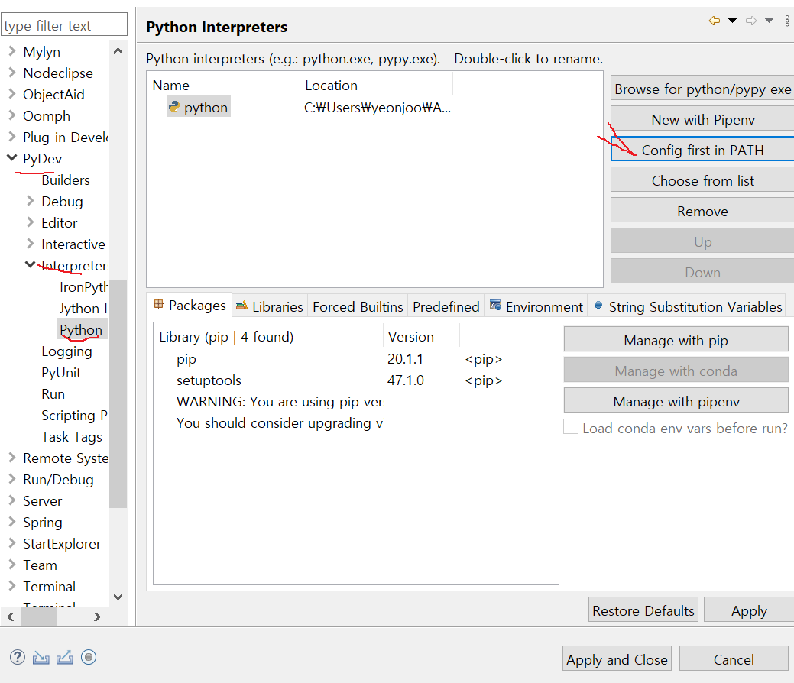

## 파이썬 설치

1. python.org 접속
2. Downloads 탭에 All releases
3. python 3.8.5 클릭 https://www.python.org/downloads/release/python-385/
4. files에 Windows x86-64 executable installer 클릭

#### 이클립스

---

- 프로젝트별로 Interpreters 설정가능

1. 마켓플레이스 에서 python 검색
2. PyDev 설치
3. 깃허브 설치했을때 깃 추가하듯이 JavaEE 왼쪽에 PyDev 추가
4. Window > Preferences > PytDev > Interpreters > Python Interpreter
5. config first in PATH 클릭해서 파이썬 추가
6. New Project PyDev폴더에 PyDev 프로젝트

1. 한글설정
2. 우클릭 > new > PyDev모듈 만듬 